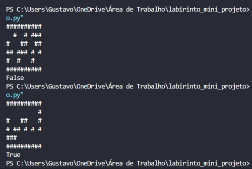

# Labirinto Mini-projeto
## Resumo
O projeto se trata de um desafio proposto pelo professor para colocar em prática os conhecimetos em pilhas com Python.
Dado um labirinto onde "#" são as paredes, o programa deve analisar se é possível sair do labirinto. Se for possível, deverá retornar True, caso contrário deverá retornar False. A ideia foi utilizar a pilha para marcar os espaços já marcado, pois caso encontre um caminho sem saída o programa vai voltar e checar se não tem mais outra saída.

## Integrantes da equipe
- Caymi Ferreira
- Hebert Ivisson
- Luis Gustavo

## Conteúdo de consulta para realização do projeto (sites, livros, artigos, códigos prontos, etc.)
Observando somente os conteúdos e anotações discutidos em sala de aula, juntamente com alguns vídeos relacionados ao tema das pilhas/filas, como complemento ao nosso aprendizado.
Vídeo: Hallison Paz - PILHAS EM PYTHON / ESTRUTURA DE DADOS #7 - https://youtu.be/YETRHzwrrvo?si=zfBeVwwQYO1jjlCw
Livro: Seções 3.1 a 3.14 do livro https://panda.ime.usp.br/panda/static/pythonds_pt/index.html

## Foi possível realizar tudo que foi proposto?
Sim, acreditamos que tudo que foi proposto foi realizado no projeto em questão.

## Problemas identificados no projeto

## Tecnologias utilizadas

